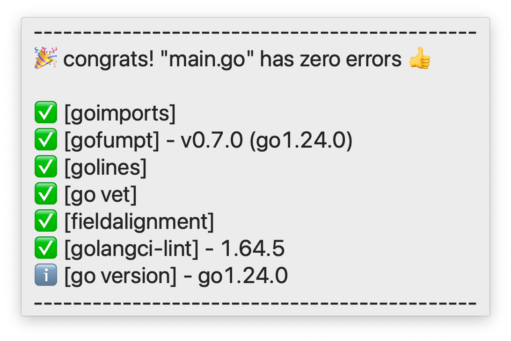
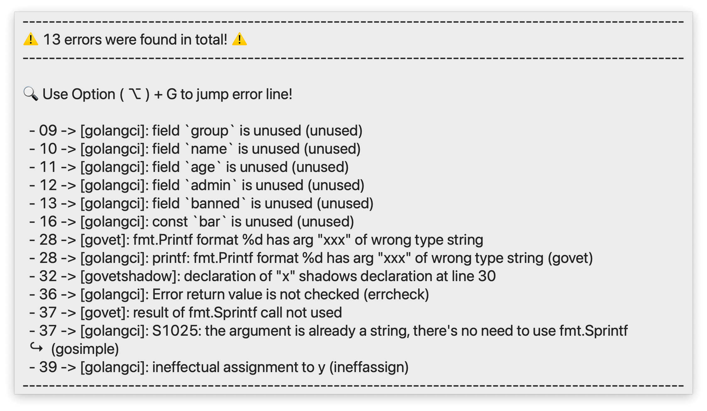

# TextMate2 Golang Bundle

If you’re still using [TextMate 2][textmate2] in 2025 and developing with
[Go][golang], this TextMate bundle will be a game-changer for you! 🚀


---

## Installation

You need `go` installation:

```bash
brew install go golangci-lint
```

Check if your `go` installation is ok?

```bash
$ go version
go version go1.24.0 darwin/arm64
```

Now clone this repo:

```bash
cd ~/Library/Application\ Support/TextMate/Bundles/
git clone git@github.com:vigo/textmate2-golang.git TextMate2-Golang.tmbundle
```

Now restart TextMate. You need to set `TM_GO` and `TM_GOPATH` TextMate
variables:

```bash
defaults write com.macromates.TextMate environmentVariables \
    -array-add "{enabled = 1; value = \"$(command -v go)\"; name = \"TM_GO\"; }"

defaults write com.macromates.TextMate environmentVariables \
    -array-add "{enabled = 1; value = \"$(go env GOPATH)\"; name = \"TM_GOPATH\"; }"
```

You need to set `PATH` manually from `TextMate > Settings > Variables`:

    PATH    "${TM_GOPATH}/bin:/opt/homebrew/bin:${PATH}"

You can also set manually from your global or project based `.tm_properties`
file, I prefer this way:

    TM_GO=/path/to/go/libexec/bin/go  # result of command -v go
    TM_GOPATH=/path/to/go             # result of go env GOPATH
    PATH="${TM_GOPATH}/bin:/opt/homebrew/bin:${PATH}"

> It’s not possible to execute shell command in `.tm_properties` therefore
you need to set values by your hand!

If you are an old/aged developer like me :) you can set bigger fonts via:

```bash
defaults write com.macromates.TextMate NSToolTipsFontSize 24
```

You need to install go related tools, all are optional:

- `goimports`: Auto adds required imports.
- `gofumpt`: Shows `gofmt` errors but stricter.
- `golines`: Breaks long lines even long comments.
- `shadow`: Checks variable shadowing.
- `fieldalignment`: Auto fixes struct field alignments.
- `golangci-lint`: Fastest linter for Go!

```bash
go install golang.org/x/tools/cmd/goimports@latest
go install mvdan.cc/gofumpt@latest
go install github.com/segmentio/golines@latest
go install golang.org/x/tools/go/analysis/passes/shadow/cmd/shadow@latest
go install golang.org/x/tools/go/analysis/passes/fieldalignment/cmd/fieldalignment@latest
```

You can install tools according to your feature toggles with using
<kbd>⌥</kbd> + <kbd>I</kbd> (Option + I).

---

## Usage

Open your go projects and hit **Save**





---

## TODO

- [X] `goimports`
- [X] `gofumpt`
- [X] `golines`
- [X] `go vet`
- [X] `shadow`
- [X] `fieldalignment`
- [X] `golangci-lint`
- [ ] `gopls` LSP
- [X] Go to error line
- [ ] Lots of snippets
- [X] Go tools updater script

---

## TextMate Variables

| Variable | Default Value | Description |
|:---------|:--------------|:------------|
| `ENABLE_LOGGING` |  | Set this for bundle development purposes. |
| `LOG_LEVEL` | `"DEBUG"` | Set this for bundle development purposes. |
| `TM_GOLANG_TOOLTIP_LINE_LENGTH` | `"100"` | Length of tool tip window |
| `TM_GOLANG_TOOLTIP_LEFT_PADDING` | `"2"` | Left char padding of tool tip window |
| `TM_GOLANG_TOOLTIP_BORDER_CHAR` | `"-"` | Line char of tool tip window |
| `TM_GO` |  | Path to your `go` binary (e.g: `/opt/homebrew/opt/go/libexec/bin/go` )  |
| `TM_GOPATH` |  | Your `GOPATH` from `go env GOPATH` (e.g: `/Users/vigo/.local/go` find the value via `go env GOPATH` )  |
| `TM_GOLANG_DISABLE` |  | Disable bundle |
| `TM_GOLANG_DISABLE_GOIMPORTS` |  | Disable `goimports` auto fixes. |
| `TM_GOLANG_DISABLE_GOFUMPT` |  | Disable `gofumpt` checks. |
| `TM_GOLANG_DISABLE_GOLINES` |  | Disable `golines` fixes. |
| `TM_GOLANG_DISABLE_GOVET` |  | Disable `go vet` checks. |
| `TM_GOLANG_DISABLE_GOSHADOW` |  | Disable `go vet` with `shadow` checks. |
| `TM_GOLANG_DISABLE_FIELDALIGNMENT` |  | Disable `fieldalignment` auto fixes. |
| `TM_GOLANG_DISABLE_GOLANGCI_LINTER` |  | Disable `golangci-lint` checks. |
| `TM_GOIMPORTS_BINARY` | | Optional, set if you have different installation. |
| `TM_GOFUMPT_BINARY` | | Optional, set if you have different installation. |
| `TM_GOLINES_BINARY` | | Optional, set if you have different installation. |
| `TM_GOSHADOW_BINARY` | | Optional, set if you have different installation. |
| `TM_GOLANGCI_LINTER_BINARY` | | Optional, set if you have different installation. |
| `TM_GOFIELDALIGNMENT_BINARY` | | Optional, set if you have different installation. |
| `TM_GOLINES_MAX_LEN` | `"100"` | Maximum line length for `golines` |
| `TM_GOLINES_TAB_LEN` | `"4"` | Length of TAB for `golines` |
| `TM_GOLINES_SHORTEN_COMMENTS` | | Enable shorten comments too! |
| `GOLANGCI_LINTER_OPTIONS` | | By pass linter config file, disable all and use only given options. |

To set your TextMate variables, go to `TextMate > Settings > Variables` and
set the values. Some variables only need to have any value assigned in order
to be activated. Such as:

    TM_GOLANG_DISABLE                   1
    TM_GOLANG_DISABLE_GOIMPORTS         1
    TM_GOLANG_DISABLE_GOFUMPT           1
    TM_GOLANG_DISABLE_GOLINES           1
    TM_GOLANG_DISABLE_GOVET             1
    TM_GOLANG_DISABLE_GOSHADOW          1
    TM_GOLANG_DISABLE_FIELDALIGNMENT    1
    TM_GOIMPORTS_BINARY                 /path/to/goimports
    TM_GOFUMPT_BINARY                   /path/to/gofumpt
    TM_GOLINES_BINARY                   /path/to/golines
    TM_GOSHADOW_BINARY                  /path/to/shadow
    TM_GOFIELDALIGNMENT_BINARY          /path/to/fieldalignment
    TM_GOLANGCI_LINTER_BINARY           /path/to/golangci-lint
    TM_GOLINES_MAX_LEN                  120
    TM_GOLINES_TAB_LEN                  2
    TM_GOLINES_SHORTEN_COMMENTS         1

To disable this bundle, set `TM_GOLANG_DISABLE` from `TextMate > Settings > Variables` 
or from `.tm_properties` (local or global)

    TM_GOLANG_DISABLE=1

To set/toggle features from `.tm_properties`:

    # development only
    ENABLE_LOGGING=1
    LOG_LEVEL=DEBUG         # possible values are
                            # DEBUG, INFO, WARN, ERROR, FATAL
    # disable feature(s)
    # TM_GOLANG_DISABLE_GOIMPORTS=1
    # TM_GOLANG_DISABLE_GOFUMPT=1
    # TM_GOLANG_DISABLE_GOLINES=1
    # TM_GOLANG_DISABLE_GOVET=1
    # TM_GOLANG_DISABLE_GOSHADOW=1
    # TM_GOLANG_DISABLE_FIELDALIGNMENT=1
    # TM_GOLANG_DISABLE_GOLANGCI_LINTER=1
    
    # custom params
    # TM_GOLINES_MAX_LEN=120
    # TM_GOLINES_TAB_LEN=2
    # TM_GOLINES_SHORTEN_COMMENTS=1
    
    # if you have custom binaries to set
    # TM_GOIMPORTS_BINARY=/path/to/goimports
    # TM_GOFUMPT_BINARY=/path/to/gofumpt
    # TM_GOLINES_BINARY=/path/to/golines
    # TM_GOSHADOW_BINARY=/path/to/shadow
    # TM_GOFIELDALIGNMENT_BINARY=/path/to/fieldalignment
    # TM_GOLANGCI_LINTER_BINARY=/path/to/golangci-lint

or with `defaults` command:

```bash
# disable bundle! nothing will work...
defaults write com.macromates.TextMate environmentVariables \
    -array-add "{enabled = 1; value = \"1\"; name = \"TM_GOLANG_DISABLE\"; }"

# example: enable logging
defaults write com.macromates.TextMate environmentVariables \
    -array-add "{enabled = 1; value = \"1\"; name = \"ENABLE_LOGGING\"; }"

# example: set log level
defaults write com.macromates.TextMate environmentVariables \
    -array-add "{enabled = 1; value = \"ERROR\"; name = \"LOG_LEVEL\"; }"

# disable goimports
defaults write com.macromates.TextMate environmentVariables \
    -array-add "{enabled = 1; value = \"1\"; name = \"TM_GOLANG_DISABLE_GOIMPORTS\"; }"

# disable gofumpt
defaults write com.macromates.TextMate environmentVariables \
    -array-add "{enabled = 1; value = \"1\"; name = \"TM_GOLANG_DISABLE_GOFUMPT\"; }"

# disable golines
defaults write com.macromates.TextMate environmentVariables \
    -array-add "{enabled = 1; value = \"1\"; name = \"TM_GOLANG_DISABLE_GOLINES\"; }"

# disable govet
defaults write com.macromates.TextMate environmentVariables \
    -array-add "{enabled = 1; value = \"1\"; name = \"TM_GOLANG_DISABLE_GOVET\"; }"

# disable shadow
defaults write com.macromates.TextMate environmentVariables \
    -array-add "{enabled = 1; value = \"1\"; name = \"TM_GOLANG_DISABLE_GOSHADOW\"; }"

# disable fieldalignment
defaults write com.macromates.TextMate environmentVariables \
    -array-add "{enabled = 1; value = \"1\"; name = \"TM_GOLANG_DISABLE_FIELDALIGNMENT\"; }"

# disable golangci-lint
defaults write com.macromates.TextMate environmentVariables \
    -array-add "{enabled = 1; value = \"1\"; name = \"TM_GOLANG_DISABLE_GOLANGCI_LINTER\"; }"

# set golines max line length
defaults write com.macromates.TextMate environmentVariables \
    -array-add "{enabled = 1; value = \"120\"; name = \"TM_GOLINES_MAX_LEN\"; }"

# set golines tab length
defaults write com.macromates.TextMate environmentVariables \
    -array-add "{enabled = 1; value = \"2\"; name = \"TM_GOLINES_TAB_LEN\"; }"

# enable golines for comments too!
defaults write com.macromates.TextMate environmentVariables \
    -array-add "{enabled = 1; value = \"1\"; name = \"TM_GOLINES_SHORTEN_COMMENTS\"; }"

# example: disable all golangci-lint checkers and use given options,
# only check: errcheck and gosimple errors.
defaults write com.macromates.TextMate environmentVariables \
    -array-add "{enabled = 1; value = \"-E errcheck -E gosimple\"; name = \"GOLANGCI_LINTER_OPTIONS\"; }"

# set custom path for goimports
defaults write com.macromates.TextMate environmentVariables \
    -array-add "{enabled = 1; value = \"/path/to/goimports\"; name = \"TM_GOIMPORTS_BINARY\"; }"

# set custom path for gofumpt
defaults write com.macromates.TextMate environmentVariables \
    -array-add "{enabled = 1; value = \"/path/to/gofumpt\"; name = \"TM_GOFUMPT_BINARY\"; }"

# set custom path for golines
defaults write com.macromates.TextMate environmentVariables \
    -array-add "{enabled = 1; value = \"/path/to/golines\"; name = \"TM_GOLINES_BINARY\"; }"

# set custom path for shadow
defaults write com.macromates.TextMate environmentVariables \
    -array-add "{enabled = 1; value = \"/path/to/shadow\"; name = \"TM_GOSHADOW_BINARY\"; }"

# set custom path for fieldalignment
defaults write com.macromates.TextMate environmentVariables \
    -array-add "{enabled = 1; value = \"/path/to/fieldalignment\"; name = \"TM_GOFIELDALIGNMENT_BINARY\"; }"

# set custom path for golangci-lint
defaults write com.macromates.TextMate environmentVariables \
    -array-add "{enabled = 1; value = \"/path/to/golangci-lint\"; name = \"TM_GOLANGCI_LINTER_BINARY\"; }"
```

---

## Hot Keys and Snippets

### Hot Keys

| Hot Keys | Description |
|:---------|:------------|
| <kbd>⌥</kbd> + <kbd>I</kbd> | Install go tools. <small>(option + I)</small> |
| <kbd>⌥</kbd> + <kbd>G</kbd> | Go to error marked line/column. <small>(option + G)</small> |
| <kbd>⌥</kbd> + <kbd>R</kbd> | Fix imports, formatting w/o saving file. <small>(option + R)</small> |
| <kbd>⌥</kbd> + <kbd>C</kbd> | Create `.golangci.yml` file under project root. <small>(option + C)</small> |

### Snippets

| <kbd>⇥</kbd> Triggers | Description |
|:----------------|:------------|
| `temp` + <kbd>⇥</kbd> | Create `main` package template |
| `fps` + <kbd>⇥</kbd> | fmt.Printf, fmt.Scanf, fmt.Sprintf |
| `prl` + <kbd>⇥</kbd> | fmt.Println |
| `prf` + <kbd>⇥</kbd> | fmt.Printf helpers |
| `spr` + <kbd>⇥</kbd> | fmt.Sprintf helpers |
| `fpr` + <kbd>⇥</kbd> | fmt.Fprintf |
| `erf` + <kbd>⇥</kbd> | fmt.Errorf |
| `log` + <kbd>⇥</kbd> | log helpers |
| `ctp` + <kbd>⇥</kbd> | Compile time proof |
| `ifer` + <kbd>⇥</kbd> | `if err:= ...; err != nil` |
| `vok` + <kbd>⇥</kbd> | `val, ok := ...; ok {` |
| `st` + <kbd>⇥</kbd> | `struct` helpers |
| `for` + <kbd>⇥</kbd> | `for` helpers |

---

## Bug Report

Please set/enable the logger via setting `ENABLE_LOGGING=1`. Logs are written to
the `/tmp/textmate-golang.log` file. You can `tail` while running via;
`tail -f /tmp/textmate-golang.log` in another Terminal tab. You can see
live what’s going on. Please provide the log information for bug reporting.

After you fix the source code (next run) bundle removes those files if there
is no error. According to you bug report, you can `tail` or copy/paste the
contents of error file to issue.

Also, while running bundle script (*which is TextMate’s default ruby 1.8.7*),
if error occurs, TextMate pops up an alert window. Please add that screen shot
or try to copy error text from modal dialog.

Logger output should look like this:

    [2025-03-01 17:03:59][TM-GOLANG][WARN][storage.rb->get_storage]: storage.get not found for 0F742219-9517-454F-93FE-9EEE602B426B (/tmp/textmate-golang-0F742219-9517-454F-93FE-9EEE602B426B.error)
    [2025-03-01 17:03:59][TM-GOLANG][INFO][golang.rb->run_document_did_save]: did save
    [2025-03-01 17:03:59][TM-GOLANG][INFO][golang.rb->run_document_did_save]: enabled_checkers: [true, true, true, true, true]
    [2025-03-01 17:04:33][TM-GOLANG][WARN][storage.rb->destroy_storage]: storage.destroy not found for E2A58F4B-9845-4BD9-A231-CCC60D63D87B - (/tmp/textmate-golang-E2A58F4B-9845-4BD9-A231-CCC60D63D87B.error)
    [2025-03-01 17:04:33][TM-GOLANG][WARN][storage.rb->destroy_storage]: storage.destroy not found for E2A58F4B-9845-4BD9-A231-CCC60D63D87B - (/tmp/textmate-golang-E2A58F4B-9845-4BD9-A231-CCC60D63D87B.goto)
    [2025-03-01 17:04:33][TM-GOLANG][INFO][golang.rb->run_document_will_save]: will save
    [2025-03-01 17:04:33][TM-GOLANG][WARN][storage.rb->get_storage]: storage.get not found for E2A58F4B-9845-4BD9-A231-CCC60D63D87B (/tmp/textmate-golang-E2A58F4B-9845-4BD9-A231-CCC60D63D87B.error)
    [2025-03-01 17:04:33][TM-GOLANG][INFO][golang.rb->run_document_did_save]: did save
    [2025-03-01 17:04:33][TM-GOLANG][INFO][golang.rb->run_document_did_save]: enabled_checkers: [true, true, true, true, true]
    [2025-03-01 17:07:18][TM-GOLANG][WARN][storage.rb->destroy_storage]: storage.destroy not found for 77744A4B-FF5A-4226-B979-094B86F4C74D - (/tmp/textmate-golang-77744A4B-FF5A-4226-B979-094B86F4C74D.error)

Keep in mind that when logging is enabled, there may be some performance
degradation due to *file I/O* operations.

If you are still using TextMate like me, I eagerly await your **comments**, **bug
reports**, and **feature requests**.

---

## Change Log

You can read the whole story [here][changelog].

---

## Contributor(s)

* [Uğur "vigo" Özyılmazel](https://github.com/vigo) - Creator, maintainer

---

## Contribute

All PR’s are welcome!

1. `fork` (https://github.com/vigo/textmate2-golang/fork)
1. Create your `branch` (`git checkout -b my-features`)
1. `commit` yours (`git commit -am 'implement new features'`)
1. `push` your `branch` (`git push origin my-features`)
1. Than create a new **Pull Request**!

This project is intended to be a safe, welcoming space for collaboration, and
contributors are expected to adhere to the [code of conduct][coc].

---

## License

This project is licensed under MIT

---

[textmate2]: https://github.com/textmate/textmate
[golang]: https://go.dev/
[changelog]: https://github.com/vigo/textmate2-golang/blob/main/CHANGELOG.md
[coc]: https://github.com/vigo/textmate2-golang/blob/main/CODE_OF_CONDUCT.md